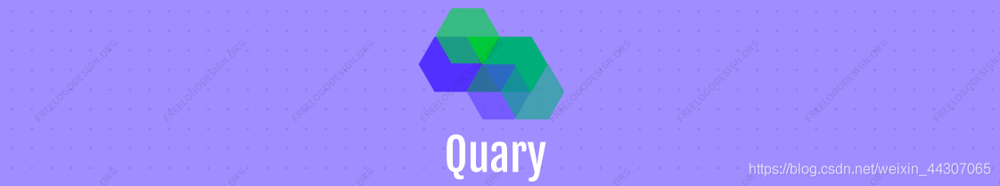

# Quary

Create my own language in Compilers Principle Lab, I call it Quary. In this repository, I provide all the source code.



enjoy it !


## 介绍

Quary语言的定义是一个很有挑战性的过程，我模仿C—和python成功定义了它（也许并不完备，随着实验的推进我会一一完善），定义语言的过程中，我对BNF语法有了新的了解和学习。为什么定义这门语言？一开始，我的想法很简单，纯粹是觉得，仿照TINY，仿照C—太无聊了！为什么不自己定义一门语言呢？随着我对语言的深入理解，现在发现，这真的是一个很有挑战性的过程，在以后的语法分析，代码优化…过程中，将会遇到更多的挑战，继续加油吧！我的设想是，定义一门自己的语言Quary，创造出自己的编译器 QueryCompiler，然后将它部署到服务器上，做一个前后端项目，让每个人可以通过网络提交到Quary！继续加油！


## 项目目录结构

```bash
$ tree ../Quary/
../Quary/
├── lab1
│   ├── DFA.drawio
│   ├── globals.h
│   ├── main.c
│   ├── Makefile
│   ├── README.assets
│   │   └── Quary4.png
│   ├── README.md
│   ├── samples
│   │   ├── sample1.qy
│   │   ├── sample2.qy
│   │   └── sample3.qy
│   ├── scan.c
│   ├── scan.h
│   ├── util.c
│   └── util.h
├── lab2
│   ├── deterNFA.cpp
│   ├── global.cpp
│   ├── global.h
│   ├── main.cpp
│   ├── Makefile
│   ├── minDFA.cpp
│   └── sample
│       ├── sample1.py
│       ├── sample2.py
│       └── sample3.py
├── README.assets
│   └── Quary4.png
└── README.md

6 directories, 24 files
```

